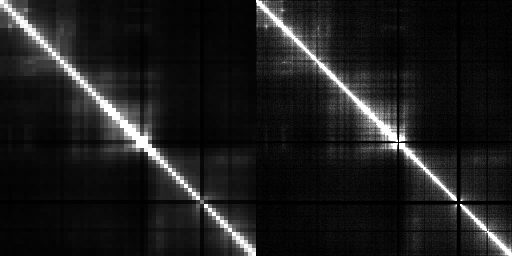

# HiC-GAN
Based on [pix2pix-tensorflow](https://github.com/affinelayer/pix2pix-tensorflow).  
A machine learning based approach to enhance the resolution of HiC interaction matrix.

## How to use
### Envirounment
- Tensorflow 1.4.1
### Prepare the data
The high-resolution sample should have the size of 256*256, the low resolution sample should be resized to 256*256 with nearest neighbor interpolation. Then Append the low resolution sample to the high resolution sample horizontally.  

### Train
Modify the path in train.sh to the input folder, then:

    bash train.sh

###Test
Modify the path of checkpoint and input folder in test.sh,, then:

    bash test.h

###Options
There are many options that you can change during the training:

 - **input_dir**: path to folder containing images
 - **mode**: "train", "test", "export"
 - **output_dir**: where to put output files
 - **seed**: random seed for the random vector
 - **checkpoint**: directory with checkpoint to resume training from or use for testing
 - **max_steps**: number of training steps
 - **max_epochs**: number of training epochs
 - **batch_size**: number of images in batch
 - **which_direction**: AtoB or BtoA
 - **ngf**: number of generator filters in first conv layer
 - **ndf**: number of discriminator filters in first conv layer
 - **flip**: flip images horizontally
 - **no_flip** don't flip images horizontally
 - **lr**: initial learning rate for adam
 - **beta1**: momentum term of adam
 - **L1_weight**: weight on L1 term for generator gradient
 - **gan_weight**: weight on GAN term for generator gradient

